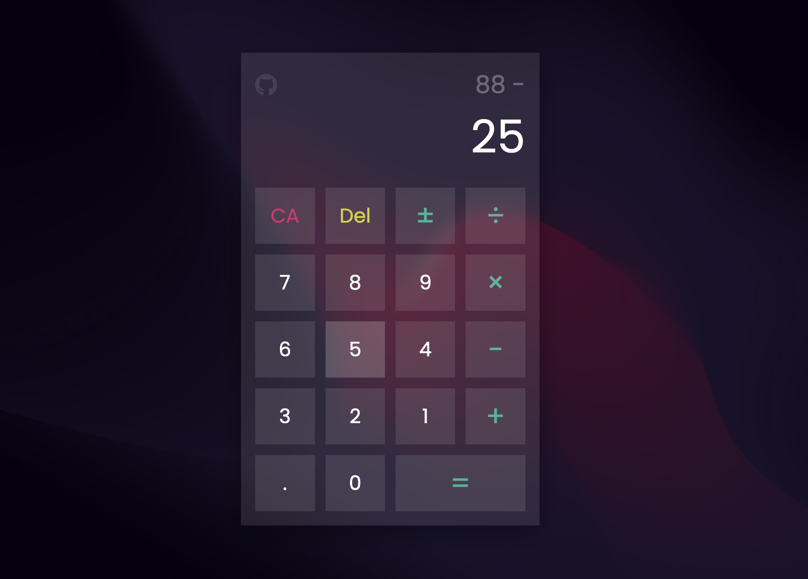

# Calculator

This project is a simple web-based calculator developed as part of the [The Odin Project](https://www.theodinproject.com/) Fundamentals course. It provides basic arithmetic operations such as addition, subtraction, multiplication, and division.

## Features

- Arithmetic Operations: Addition, Subtraction, Multiplication, Division
- Clear Button: Clear the display
- Delete Button: Delete the last digit entered
- Plus/Minus Button: Toggle between positive and negative numbers
- Equals Button: Calculate the result

## Technologies Used

- HTML5
- CSS
- JavaScript

## Screenshot

